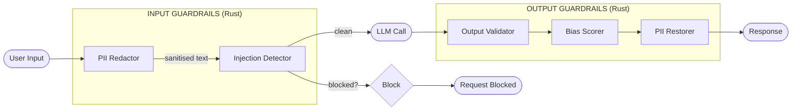
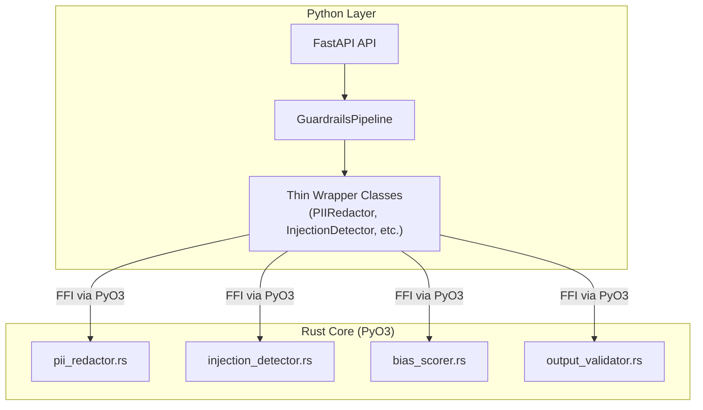

# LLM Guardrails

**Responsible AI toolkit for LLM applications -- Rust-powered, Python-friendly**

A production-grade library that wraps any LLM call with pre- and post-processing guardrails for PII protection, prompt-injection defence, bias detection, and output validation. Core guardrail logic is implemented in **Rust** (via PyO3) for high-performance regex processing, exposed through an idiomatic Python API.

---

## Features

| Guard | Stage | Description |
|---|---|---|
| **PII / PHI Redaction** | Pre & Post | Regex-based detection and reversible redaction of emails, phone numbers, SSNs, credit cards, dates of birth, IP addresses, and names. |
| **Prompt Injection Detection** | Pre | Pattern-matching engine that scores user input for known injection techniques (instruction override, role-play attacks, DAN jailbreaks, token smuggling). |
| **Bias Scoring** | Post | Flags stereotyping language, absolute generalisations, and unbalanced demographic references in LLM output. |
| **Output Validation** | Post | JSON schema validation, hedging-language (hallucination indicator) scoring, length constraints, required/blocked keyword checks. |
| **Content Safety Pipeline** | Both | `GuardrailsPipeline` chains all guards into a single `pre_process` / `post_process` workflow with per-guard enable/disable switches. |

---

## Quick Start

### Installation

```bash
# Core library (builds Rust extension automatically via maturin)
pip install .

# With the FastAPI demo server
pip install ".[api]"

# Development (tests + linting)
pip install ".[dev]"

# Development build (editable, requires maturin)
pip install maturin
maturin develop
```

### Usage

```python
from llm_guardrails import GuardrailsPipeline

pipeline = GuardrailsPipeline()

# ── Input guardrails ──────────────────────────────────
user_input = "My email is alice@example.com. Summarise this report."
pre = pipeline.pre_process(user_input)

if pre.blocked:
    print("Blocked by injection detector:", pre.injection.matched_rules)
else:
    print("Sanitised prompt:", pre.sanitised_text)
    # -> "My email is <<EMAIL_1>>. Summarise this report."

    # Send pre.sanitised_text to your LLM ...
    llm_response = call_your_llm(pre.sanitised_text)

    # ── Output guardrails ─────────────────────────────
    post = pipeline.post_process(llm_response, pre.pii_mapping)

    print("Final response:", post.final_text)      # PII restored
    print("Bias score:", post.bias.score)           # 0.0 - 1.0
    print("Valid output:", post.validation.is_valid)
```

### Individual Guards

```python
from llm_guardrails import PIIRedactor, InjectionDetector, BiasScorer

# PII redaction
redactor = PIIRedactor()
redacted, mapping = redactor.redact("Call 555-123-4567")
restored = redactor.restore(redacted, mapping)

# Injection detection
detector = InjectionDetector(threshold=0.5)
detector.detect("Ignore previous instructions")   # True
detector.score("What is 2+2?")                     # 0.0

# Bias scoring
scorer = BiasScorer()
report = scorer.score("All men are strong leaders.")
print(report.flags)  # ["Absolute generalisation about a demographic group", ...]
```

---

## API Server

Start the demo FastAPI server:

```bash
uvicorn api.main:app --reload
```

### Endpoints

| Method | Path | Description |
|---|---|---|
| `GET` | `/health` | Health check |
| `POST` | `/guard/input` | Run input guardrails (PII redaction + injection detection) |
| `POST` | `/guard/output` | Run output guardrails (validation + bias scoring + PII restore) |
| `POST` | `/guard/full` | Full pipeline: input guards --> simulated LLM --> output guards |

#### Example: Input Guard

```bash
curl -X POST http://localhost:8000/guard/input \
  -H "Content-Type: application/json" \
  -d '{"text": "My SSN is 123-45-6789. What is the weather?"}'
```

```json
{
  "sanitised_text": "My SSN is <<SSN_1>>. What is the weather?",
  "pii_mapping": {"<<SSN_1>>": "123-45-6789"},
  "injection_score": 0.0,
  "is_injection": false,
  "matched_rules": [],
  "blocked": false
}
```

---

## Architecture



### Rust / Python Boundary



**Data flow:**

1. **PII Redactor** (Rust) strips personally identifiable information and returns a reversible mapping.
2. **Injection Detector** (Rust) scores the sanitised input; if above threshold the request is blocked.
3. The cleaned prompt is forwarded to the LLM.
4. **Output Validator** (Rust) checks the response against schema, length, and hallucination rules.
5. **Bias Scorer** (Rust) flags stereotyping or unbalanced demographic language.
6. **PII Restorer** (Rust) re-inserts original PII using the mapping from step 1.

---

## Technology Stack

| Component | Technology |
|---|---|
| **Core Engine** | Rust 2021 edition |
| **Python Bindings** | PyO3 0.28 + maturin |
| **Regex Engine** | Rust `regex` crate (compiled, zero-copy) |
| **Python API** | Pydantic v2 models |
| **HTTP Layer** | FastAPI + Uvicorn |
| **Build** | maturin (PEP 517 compliant) |
| **Container** | Multi-stage Docker (Rust build + slim runtime) |

---

## Docker

```bash
# Build
docker build -t llm-guardrails .

# Run
docker run -p 8000:8000 llm-guardrails

# Test
curl http://localhost:8000/health
```

---

## Configuration

Copy `.env-template` to `.env` and customise:

| Variable | Default | Description |
|---|---|---|
| `GUARDRAILS_INJECTION_THRESHOLD` | `0.5` | Injection score threshold (0.0 permissive -- 1.0 strict) |
| `GUARDRAILS_PII_ENABLED` | `true` | Enable PII redaction/restoration |
| `GUARDRAILS_INJECTION_ENABLED` | `true` | Enable injection detection |
| `GUARDRAILS_BIAS_ENABLED` | `true` | Enable bias scoring |
| `GUARDRAILS_OUTPUT_VALIDATION_ENABLED` | `true` | Enable output validation |
| `GUARDRAILS_MAX_OUTPUT_LENGTH` | `4096` | Maximum output character count |
| `API_HOST` | `0.0.0.0` | API server bind address |
| `API_PORT` | `8000` | API server port |

---

## Compliance Notes

### GDPR

- **No PII persistence.** The `PIIRedactor` operates entirely in memory. PII values are stored only in a transient `dict` that the caller controls; the library never writes PII to disk, logs, or external services.
- **Data minimisation.** Only the redacted text is forwarded to the LLM. The original PII never leaves the trust boundary unless the caller explicitly calls `restore()`.
- **Right to erasure.** Because PII is never persisted by the library, discarding the mapping dictionary is equivalent to erasure.

### HIPAA

- PHI patterns (dates of birth, SSNs used as MRNs) are covered by the PII redactor.
- For full HIPAA compliance, deploy the library within a BAA-covered environment and ensure the LLM provider is also covered.

### Auditability

- Every guardrail returns structured, serialisable results (`BiasReport`, `InjectionResult`, `ValidationResult`) suitable for logging to an audit trail.
- The `GuardrailsPipeline` surfaces all intermediate scores so compliance teams can review flagged interactions.

---

## Development

```bash
# Prerequisites
rustc --version   # Rust toolchain required
pip install maturin

# Build the native extension in development mode
maturin develop

# Run tests
pytest

# Run Rust unit tests
cargo test

# Lint
ruff check .
ruff format --check .
```

---

## License

MIT
