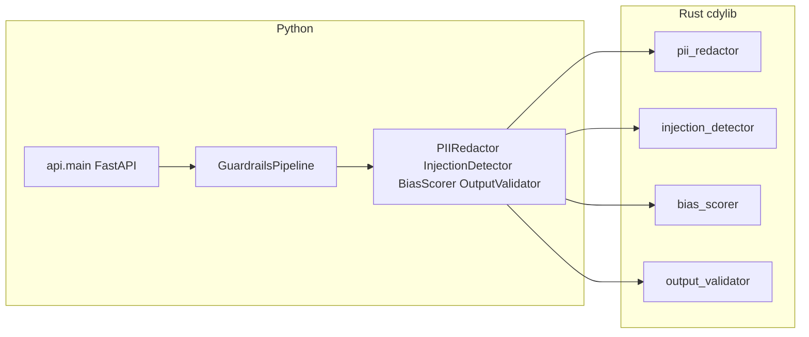
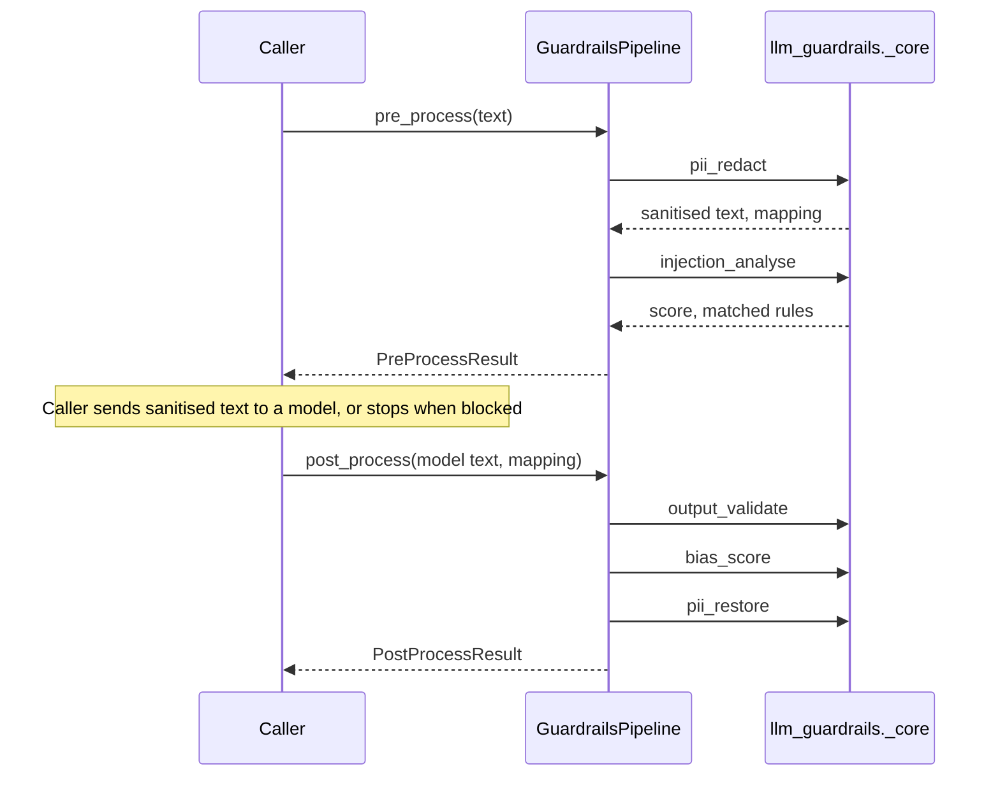

# LLM Guardrails

A Python library that redacts PII, scores prompts for injection patterns, scores model
output for a few bias patterns, and checks that output against a small set of rules.
The checks run in Rust and are called from Python through PyO3. A FastAPI app in `api/`
demonstrates the pipeline. It does not call a model.

## ⚡ Stack

- 🦀 Rust on the stable toolchain in `rust-toolchain.toml`, with the `regex` crate
- 🐍 Python 3.11, 3.12, 3.13, or 3.14. Development uses 3.14 (`.python-version`). [uv](https://docs.astral.sh/uv/) installs it
- 🔗 [PyO3](https://pyo3.rs/) and [maturin](https://www.maturin.rs/), so `llm_guardrails._core` is the extension module
- 📦 Pydantic v2 models on the Python side of each guard
- 🚀 [FastAPI](https://fastapi.tiangolo.com/) demo
- 🧪 pytest, ruff, `cargo fmt`, `cargo clippy -D warnings`, `cargo test`

## 🚀 Get Started

### Requirements

- [Rust](https://rustup.rs/), via rustup. Opening the repo selects the stable channel in `rust-toolchain.toml`
- [uv](https://docs.astral.sh/uv/getting-started/installation/)
- Python 3.11, 3.12, 3.13, or 3.14. `uv sync` reads `.python-version` and uses 3.14

### Install

```bash
pip install ferroguard
```

```python
import llm_guardrails
```

The project on PyPI is `ferroguard`. The import name stays `llm_guardrails`.
Wheels are abi3 for Python 3.11 and newer, so one wheel covers 3.11 through 3.14.

### Run It

```bash
uv sync --all-extras
uv run uvicorn api.main:app --reload
```

| What | Where |
| --- | --- |
| 🩺 Health | http://localhost:8000/health |
| 📖 Interactive API docs | http://localhost:8000/docs |
| 📄 OpenAPI document | http://localhost:8000/openapi.json |

`GET /health` returns `{"status":"ok","version":"<installed>"}`. That version is the
installed `ferroguard` distribution, read from package metadata. Maturin takes
it from `Cargo.toml`. It is not hard-coded in `api/main.py`.

Guard text from Python:

```python
from llm_guardrails import GuardrailsPipeline

pipeline = GuardrailsPipeline()
pre = pipeline.pre_process("My email is alice@example.com. Summarise this report.")

if pre.blocked:
    print(pre.injection.matched_rules)
else:
    print(pre.sanitised_text)
    # "My email is <<EMAIL_1>>. Summarise this report."
    post = pipeline.post_process("Paris is the capital of France.", pre.pii_mapping)
    print(post.final_text)
    print(post.bias.score)
    print(post.validation.is_valid)
```

`GuardrailsPipeline` takes its switches as constructor arguments (`pii_enabled`,
`injection_enabled`, `bias_enabled`, `output_validation_enabled`, `injection_threshold`,
`validation_rules`). `.env-template` lists similar names. Nothing in the library or the
demo reads that file.

The demo does not call an LLM. `POST /guard/full` uses `simulated_llm_response` when you
send one, and otherwise echoes a stub that quotes the sanitised prompt.

## 🛠️ Development

```bash
uv sync --locked --all-extras
uv run ruff check .
uv run ruff format --check .
uv run pytest
cargo fmt --check
cargo clippy --all-targets -- -D warnings
cargo test
python3 scripts/release_subject.py --self-test
python3 scripts/release_publish.py --self-test
```

`uv sync --locked --all-extras` builds the extension and installs the `api`
extra. pytest and ruff come from the default `dev` dependency group, not an
extra. pytest needs that build because the wrappers import `llm_guardrails._core`.
`cargo test` runs the Rust tests without Python.
With [just](https://just.systems/) installed, `just setup` syncs the lockfile and
runs `maturin develop`, and `just ci` runs the checks above plus
`python3 scripts/test_guardrails.py`.

Two places to change when a guard's behaviour changes:

- the Rust function in `src/`
- the wrapper in `llm_guardrails/`, which should stay a conversion to a pydantic model

`api/main.py` should keep calling `GuardrailsPipeline` rather than growing its own checks.

## 📖 The API Documentation

FastAPI builds the document from the route functions.

| What | Where |
| --- | --- |
| 📖 Interactive reference | http://localhost:8000/docs |
| 📄 The document | http://localhost:8000/openapi.json |

| Method | Path | What it does |
| --- | --- | --- |
| `GET` | `/health` | Returns status and the installed package version |
| `POST` | `/guard/input` | `pre_process`: PII placeholders, an injection score, and an opaque `pii_mapping_id` |
| `POST` | `/guard/output` | `post_process`: validation, bias score, and PII restore for that id |
| `POST` | `/guard/full` | Input guards, then a stub or caller-supplied response, then output guards |

`text` is limited to 8000 characters. A request body larger than 32768 bytes is
rejected with `413` and a message that names the limit. A `text` field over the
character limit is `422`.

**Breaking.** `/guard/input` no longer returns the placeholder map. The map stays
in process memory for 15 minutes under `pii_mapping_id`, or it is not stored at
all when the map is empty. `/guard/full` does not store a map: restore happens
inside that request, and its `pii_mapping_id` is null. `/guard/output` takes the
id, pops the map, and rejects a client-supplied `pii_mapping`. A second call with
the same id is `404`, the same as an unknown or expired id. An unknown field on
`/guard/input` or `/guard/full` is `422`. Raw PII is not in the input response.
The store is not shared: an id works only for the worker or replica that created
it, and it is lost on restart. The library `GuardrailsPipeline` still returns the
map to in-process callers; only the HTTP API hides it.

Input example:

```bash
curl -s -X POST http://localhost:8000/guard/input \
  -H 'Content-Type: application/json' \
  -d '{"text": "My SSN is 123-45-6789. What is the weather?"}'
```

A blocked prompt (the injection score is at least the threshold, default `0.5`) comes back
with `"blocked": true` and no output section on `/guard/full`.

## ✅ Testing

```bash
uv run pytest
cargo test
```

pytest covers the wrappers and `GuardrailsPipeline` (`tests/`). `cargo test` covers the
regex helpers in `src/`. The demo routes have no automated test yet.

## 🚢 Deployment

The image in `Dockerfile` builds a wheel with maturin on `python:3.12-slim`, installs that
wheel plus FastAPI and `uvicorn[standard]>=0.54.0,<1.0`, and serves `api.main:app` on
port 8000. The Python and uv image references include a digest. Dependabot's weekly
`docker` group opens a pull request when those digests move. The Rust compiler channel
stays `stable`. The image downloads rustup-init `1.29.3` and checks its SHA256 before
running it. Refreshing that installer means changing `RUSTUP_VERSION` and both
architecture checksums in the same edit. Dependabot does not change those checksums.

```bash
docker build -t llm-guardrails .
docker run --rm -p 8000:8000 llm-guardrails
curl -s http://localhost:8000/health
```

The image does not load `.env-template`. Local development uses uv and Python 3.14.
PyPI publishing runs inside the release workflow. It is not a separate tag workflow.

GitHub Actions, on pull requests and on pushes to `main`:

- `CI` runs ruff, mypy on `llm_guardrails/`, pytest on Python 3.11 and 3.14, a wheel build that imports on 3.11 and 3.14, and `cargo fmt`, clippy, and `cargo test`
- `Security` runs cargo-deny and pip-audit
- `CodeQL` analyses Python and Rust with `build-mode: none`
- `Release` runs on a push to `main`. It commits `.version` and `CHANGELOG.md`, pushes that commit to `main` without `--force`, then pushes the tag. The same run builds the abi3 wheels and sdist and publishes them to PyPI. See [RELEASING.md](RELEASING.md)
- `Scorecard` runs the OpenSSF Scorecard on `main` and on a weekly schedule

## 🔒 Security

What the library actually does:

- **PII.** `src/pii_redactor.rs` replaces matches with `<<LABEL_N>>` and returns the map.
  Labels are `SSN`, `CREDIT_CARD`, `EMAIL`, `PHONE`, `IP_ADDRESS`, `DATE_OF_BIRTH`, and
  `NAME` (two consecutive capitalised words). A card number is a run of 13–19 digits
  with optional spaces or dashes that also passes the Luhn check. An SSN whose area is
  `000`, `666`, or `9xx`, whose group is `00`, or whose serial is `0000` is left as
  written. A phone-shaped slice inside a longer digit run is left alone.
  A name or date of birth is redacted only when a context word sits next to
  it (`name`, `born`, `DOB`, `Dr.`, `Ms.`, or `Dr`/`Ms` followed by a
  capitalised word). The default redacts less than before: `Jane Doe called`
  is not redacted, and there is no switch that restores the old match of
  every title-case pair or every date. `PIIRedactor` and `GuardrailsPipeline`
  take `allow_entities` and `deny_entities` (pipeline: `pii_allow_entities`,
  `pii_deny_entities`). An empty allow list raises `ValueError`, and so does
  a label that is not one of those seven. On `PIIRedactor` those two attributes
  are read-only after construction: assigning them raises `AttributeError`.
  Restoration is a straight string
  replace of the placeholders.
- **Injection.** Eight regular expressions (`ignore_previous`, `reveal_system_prompt`,
  `role_play_attack`, `developer_mode`, `encoding_evasion`, `do_anything_now`,
  `system_role_injection`, `token_smuggling`). Text is normalised first: NFKC,
  invisible characters removed, common homoglyphs folded, and spaced-out letters
  collapsed (`i g n o r e`). The `DAN` token is uppercase only, so "Dan" is not a
  jailbreak; "do anything now" still matches in any case. The score is the highest
  matching weight, plus `0.10` when two or more rules match, capped at `1.0`.
- **Bias.** A handful of stereotype patterns, a gendered-token imbalance check, and an
  absolute-generalisation pattern. The score is a weighted sum of those hits, capped at `1.0`.
- **Output.** Optional max length, a top-level JSON `type` and `required` check (not full
  JSON Schema), a hedging-phrase score exposed as `hallucination_score`, and
  required/blocked keyword checks. A hedging hit is a `warning` and does not by itself
  clear `is_valid`.

The map of original PII stays in memory and is handed back to the caller. The library does
not write it to disk. Discarding the map is how a caller drops those values. None of this
is a complete privacy, safety, or compliance programme. Pair it with the controls your
deployment actually needs, and do not send raw prompts to a model provider you have not
reviewed.

CI rejects known-vulnerable and yanked Rust crates (`deny.toml`) and known-vulnerable
Python dependencies (`pip-audit`).

## How the pieces fit


```mermaid
flowchart LR
    subgraph python [Python]
        API[api.main FastAPI]
        PIPE[GuardrailsPipeline]
        WRAP[PIIRedactor InjectionDetector BiasScorer OutputValidator]
    end
    subgraph rust [Rust cdylib]
        PII[pii_redactor]
        INJ[injection_detector]
        BIAS[bias_scorer]
        VAL[output_validator]
    end
    API --> PIPE --> WRAP
    WRAP --> PII
    WRAP --> INJ
    WRAP --> BIAS
    WRAP --> VAL
```


```mermaid
sequenceDiagram
    participant Caller
    participant Pipeline as GuardrailsPipeline
    participant Rust as llm_guardrails._core
    Caller->>Pipeline: pre_process(text)
    Pipeline->>Rust: pii_redact
    Rust-->>Pipeline: sanitised text, mapping
    Pipeline->>Rust: injection_analyse
    Rust-->>Pipeline: score, matched rules
    Pipeline-->>Caller: PreProcessResult
    Note over Caller: Caller sends sanitised text to a model, or stops when blocked
    Caller->>Pipeline: post_process(model text, mapping)
    Pipeline->>Rust: output_validate
    Pipeline->>Rust: bias_score
    Pipeline->>Rust: pii_restore
    Pipeline-->>Caller: PostProcessResult
```

## 🤝 Contributing

- 🛠️ [CONTRIBUTING.md](CONTRIBUTING.md) — setup, tests, lint, and pull requests
- 🔖 [RELEASING.md](RELEASING.md) — how a push to `main` is versioned and tagged
- 🔒 [SECURITY.md](SECURITY.md) — private vulnerability reports
- 📖 [CODE_OF_CONDUCT.md](CODE_OF_CONDUCT.md) — Contributor Covenant 2.1

## 📄 License

MIT. Copyright (c) 2026 Melroy Anthony. See [LICENSE](LICENSE).
